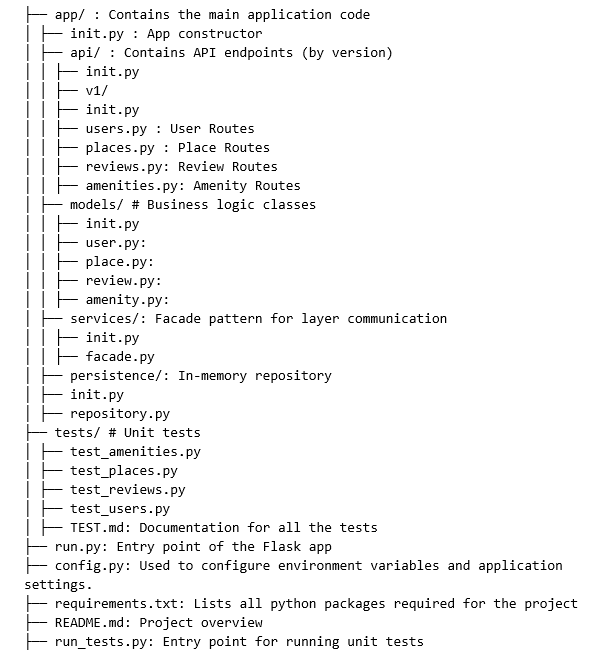

# Welcome to the HBNB - BL and API Project

## Presentation

HBnB is a RESTful API inspired by the AirBnB website, developed in Python with Flask and Flask-RESTX.  
The project follows a three-layer architecture developed in part 1 of the HBnB project.

### To run the application

1. Install dependencies using:
   `pip install -r requirements.txt`
2. Run the application:
   `python3 run.py`
3. If you want to run the test:
   `python3 run_tests.py`

The application should now be running.

---

## Purpose of each directory and file

├── app/ # Contains the main application code
│ ├── init.py # App constructor
│ ├── api/ # Contains API endpoints (by version)
│ │ ├── init.py
│ │ ├── v1/
│ │ ├── init.py
│ │ ├── users.py # User Routes
│ │ ├── places.py # Place Routes
│ │ ├── reviews.py # Review Routes
│ │ ├── amenities.py # Amenity Routes
│ ├── models/ # Business logic classes
│ │ ├── init.py
│ │ ├── user.py
│ │ ├── place.py
│ │ ├── review.py
│ │ ├── amenity.py
│ ├── services/ # Facade pattern for layer communication
│ │ ├── init.py
│ │ ├── facade.py
│ ├── persistence/ # In-memory repository
│ ├── init.py
│ ├── repository.py
├── tests/ # Unit tests
│ ├── test_amenities.py
│ ├── test_places.py
│ ├── test_reviews.py
│ ├── test_users.py
│ ├── TEST.md # API test documentation
├── run.py # Entry point of the Flask app
├── config.py # App configuration
├── requirements.txt # Dependencies
├── README.md # Project overview
├── run_tests.py # Entry point for running unit tests
