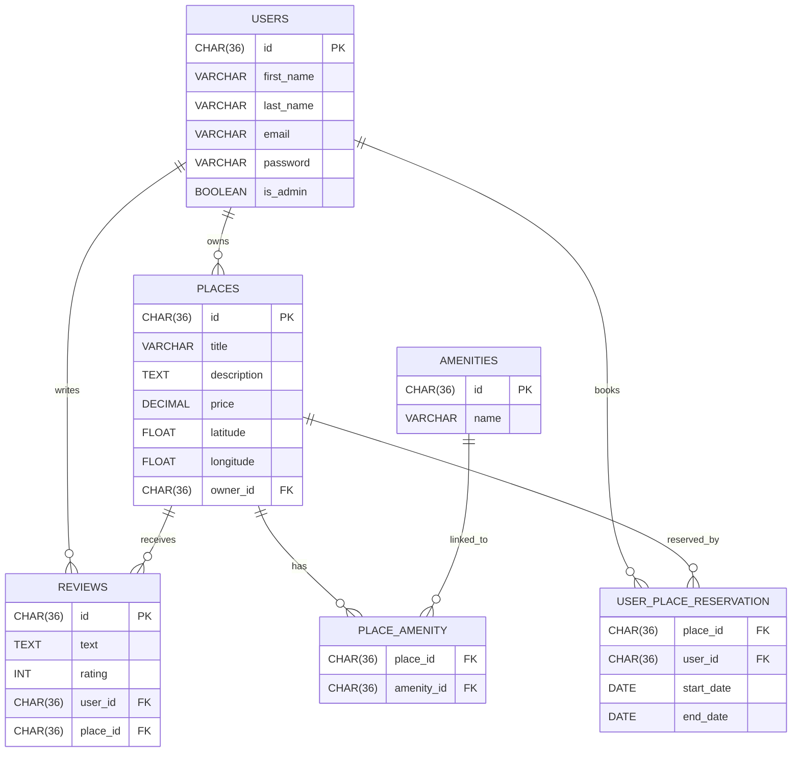

# HBnB - Full-Stack Web Application

## Overview

HBnB is a full-stack web application inspired by Airbnb.
Built in multiple phases, it evolves from a back-end API following a three-layer architecture to a full web client with authentication, database integration, and dynamic user interface.

Technologies used include **Python**, **Flask**, **Flask-RESTX**, **Flask-JWT-Extended**, **SQLAlchemy**, **SQLite/MySQL**, and front-end technologies like **HTML5**, **CSS3**, and **JavaScript ES6**.

---

## Architecture: Three-Layer Structure

HBnB is designed with a clean three-layer architecture:

- **Presentation Layer:** API routes, HTML templates, and client-side UI
- **Business Logic Layer:** Controllers, authentication, validation
- **Persistence Layer:** Database models and storage management

This separation improves scalability, maintainability, and testing.

---

## Part 1 - API Foundation & Architecture

- Developed a RESTful API inspired by Airbnb.
- Implemented core models: User, Place, Review, Amenity.
- Designed a modular structure respecting the three-layer architecture.
- Provided API documentation and project structure visualization.

---

## Part 2 - Authentication & Database Integration

- Added JWT-based authentication with **Flask-JWT-Extended**.
- Secured routes with role-based access control (`is_admin`).
- Replaced in-memory storage with **SQLite** for development, ready for **MySQL** in production.
- Modeled relational database schema with **SQLAlchemy**.
- Visualized entities and relations via Mermaid.js diagrams.
- Refined CRUD operations to interact with the database.
- Enforced data validation and constraints at the model level.

---

## Part 3 - API Enhancements & Testing

- Expanded API endpoints for complete user, place, review, and amenity management.
- Secured password storage with hashing (bcrypt).
- Implemented advanced user and admin functionalities.
- Covered API with tests using Postman and Swagger.
- Documented all endpoints with authentication requirements.
- Improved API robustness and error handling.

---

## Part 4 - Simple Web Client

- Developed a dynamic front-end using **HTML5**, **CSS3**, and **JavaScript ES6**.
- Implemented user login with JWT authentication stored in cookies.
- Created pages for login, place listing, place details, and review submission.
- Used Fetch API for asynchronous communication with the back-end.
- Enabled client-side filtering of places by country.
- Ensured authenticated users can add reviews via a secure form.
- Handled redirections based on authentication status.
- Managed sessions and tokens securely on the client side.

---

## Technologies Used

- Python 3, Flask, Flask-RESTX, Flask-JWT-Extended
- SQLAlchemy ORM, SQLite (dev), MySQL (prod-ready)
- HTML5, CSS3, JavaScript (ES6+), Fetch API, AJAX
- JWT Authentication, Cookies
- Mermaid.js for ER diagrams

---

## API Endpoints Overview

| Method | Endpoint            | Description                      | Auth Required |
|--------|---------------------|---------------------------------|---------------|
| POST   | /auth/register      | Register new user               | No            |
| POST   | /auth/login         | Authenticate & get JWT          | No            |
| GET    | /users              | List users (admin only)         | Yes           |
| GET    | /places             | List all places                 | No            |
| POST   | /places             | Create new place                | Yes           |
| PUT    | /reviews/<id>       | Update a review                 | Yes           |
| DELETE | /amenities/<id>     | Delete amenity (admin only)     | Yes           |

---

## Database Diagram



## How to Run the Application

1. Install dependencies using:
   ```bash
   pip install -r requirements.txt
   ```

2. Run the application:
   ```bash
   python3 run.py
   ```

3. To run the tests:
   ```bash
   python3 run_tests.py
   ```

4. Leave the server:
   Press `CTRL+C` to exit the server. When you launch the server, it should create an `instance` folder with the database file `development.db`.

5. Add the SQL script to the database:
   ```bash
   sqlite3 instance/development.db < app/database/schema.sql
   ```

6. The application should now be running with the SQL script implemented. You can now launch the application and open your web browser, then go to http://127.0.0.1:5000/api/v1

7. To use the web client, open:

- login.html for authentication.
- index.html for browsing places.
- place.html to view details and add reviews.

## Authors
👩‍💻 Thérèse-Marie Lefoulon & Robin David
Full-Stack Developers in training at Holberton School Laval
