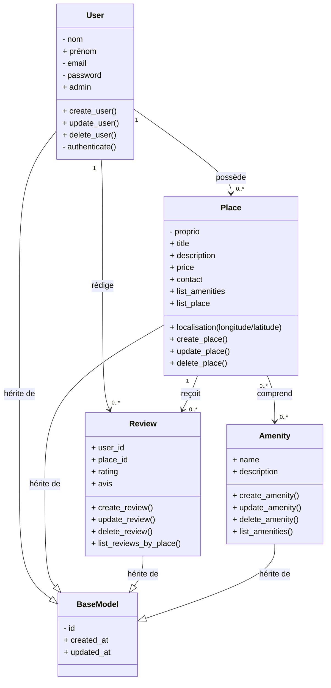

## :jigsaw: Diagramme de classes — Projet HBnB

```mermaid
---
config:
  theme: default
---
classDiagram
    class BaseModel {
        - id
        + created_at
        + updated_at
    }
    class User {
        - nom
        + prénom
        - email
        - password
        + admin
        + create_user()
        + update_user()
        + delete_user()
        - authenticate()
    }
    class Place {
        - proprio
        + title
        + description
        + price
        + localisation (longitude/latitude)
        + contact
        + list_amenities
        + create_place()
        + update_place()
        + delete_place()
        + list_place
        }
    class Review {
        + user_id
        + place_id
        + rating
        + avis
        + create_review()
        + update_review()
        + delete_review()
        + list_reviews_by_place()
    }
    class Amenity {
        + name
        + description
        + create_amenity()
        + update_amenity()
        + delete_amenity()
        + list_amenities()
    }
    %% Héritage
    User --|> BaseModel : hérite de
    Place --|> BaseModel : hérite de
    Review --|> BaseModel : hérite de
    Amenity --|> BaseModel : hérite de
    %% Relations
    User "1" --> "0..*" Place : possède
    User "1" --> "0..*" Review : rédige
    Place "1" --> "0..*" Review : reçoit
    Place "0..*" --> "0..*" Amenity : comprend
```
