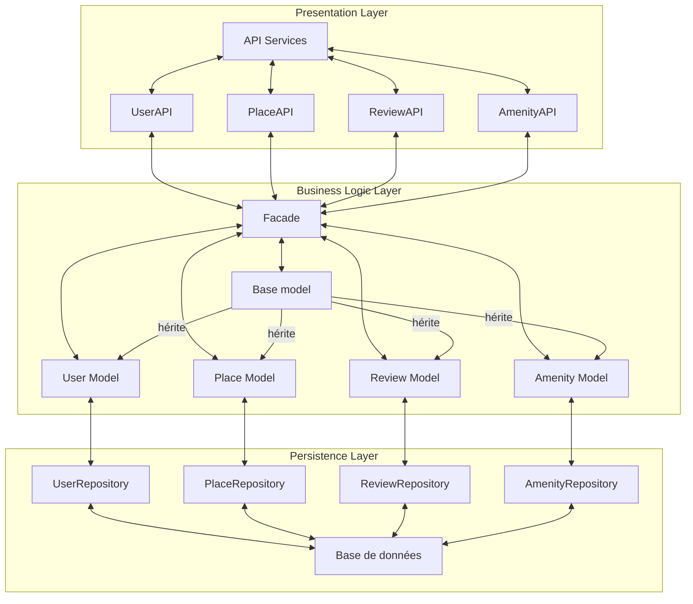

```mermaid
flowchart TD
  subgraph Presentation_Layer ["Presentation Layer"]
    apiGateway["API Services"]
    UserAPI
    PlaceAPI
    ReviewAPI
    AmenityAPI
  end

  subgraph Business_Logic_Layer ["Business Logic Layer"]
    facade["Facade"]
    userModel["User Model"]
    placeModel["Place Model"]
    reviewModel["Review Model"]
    amenityModel["Amenity Model"]
    baseModel["Base model"]
  end

  subgraph Persistence_Layer ["Persistence Layer"]
    userRepo["UserRepository"]
    placeRepo["PlaceRepository"]
    reviewRepo["ReviewRepository"]
    amenityRepo["AmenityRepository"]
    database["Base de données"]
  end

  apiGateway <--> UserAPI
  apiGateway <--> PlaceAPI
  apiGateway <--> ReviewAPI
  apiGateway <--> AmenityAPI

  UserAPI <--> facade
  PlaceAPI <--> facade
  ReviewAPI <--> facade
  AmenityAPI <--> facade

  facade <--> userModel
  facade <--> placeModel
  facade <--> reviewModel
  facade <--> amenityModel
  facade <--> baseModel

  userModel <--> userRepo
  placeModel <--> placeRepo
  reviewModel <--> reviewRepo
  amenityModel <--> amenityRepo

  userRepo <--> database
  placeRepo <--> database
  reviewRepo <--> database
  amenityRepo <--> database

baseModel -->|hérite| userModel 
baseModel -->|hérite| placeModel
baseModel -->|hérite| reviewModel
baseModel -->|hérite| amenityModel

```
