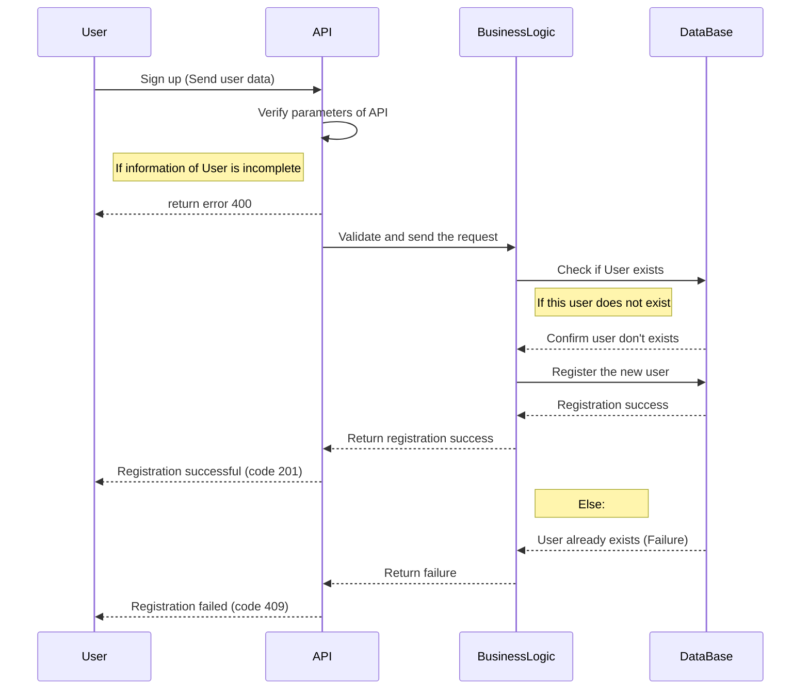
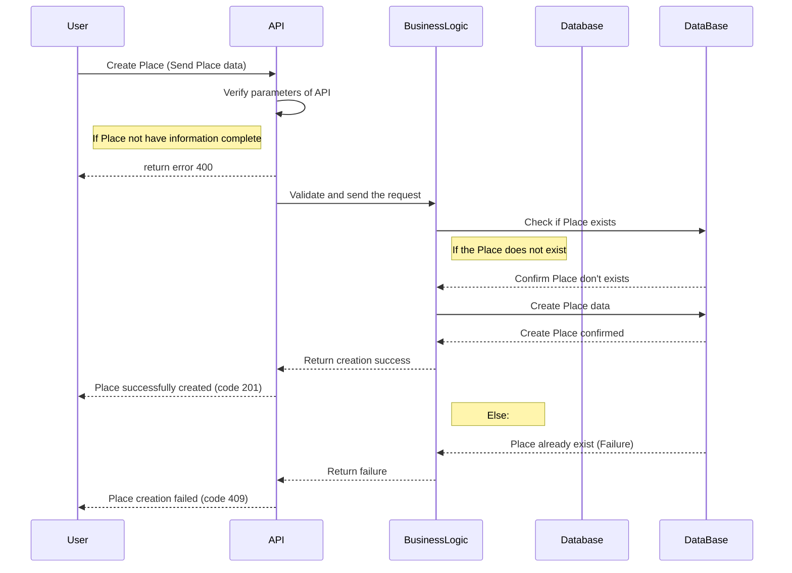
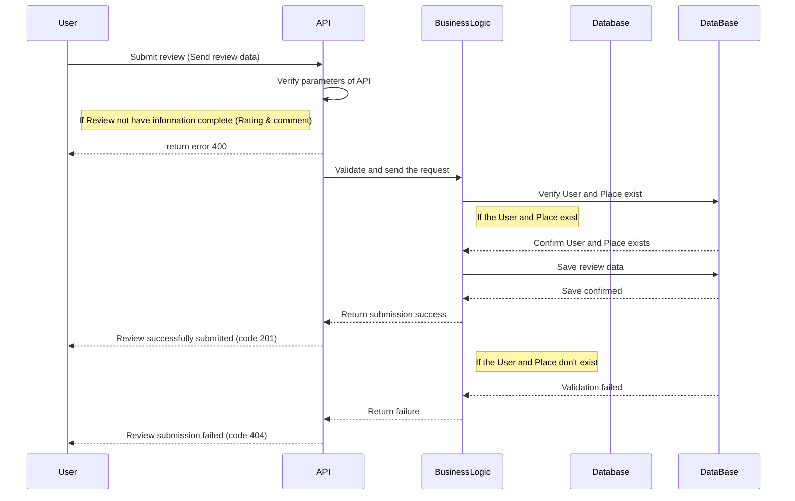
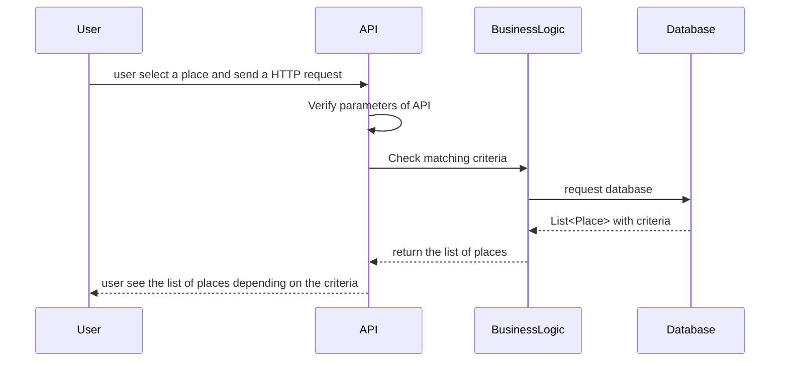

# User Registration

```mermaid
sequenceDiagram
participant User
participant API
participant BusinessLogic
participant DataBase
%% Inscription d’un nouvel utilisateur :
User->>API: Sign up (Send user data)
API->>API: Verify parameters of API
Note right of User: If information of User is incomplete
API-->>User: return error 400
API->>BusinessLogic: Validate and send the request
BusinessLogic->>DataBase: Check if User exists
Note right of BusinessLogic: If this user does not exist
DataBase-->>BusinessLogic: Confirm user don't exists
BusinessLogic->>DataBase: Register the new user
DataBase-->>BusinessLogic: Registration success
BusinessLogic-->>API: Return registration success
API-->>User: Registration successful (code 201)
Note right of BusinessLogic: Else:
DataBase-->>BusinessLogic: User already exists (Failure)
BusinessLogic-->>API: Return failure
API-->>User: Registration failed (code 409)
```

# Création d’un hébergement :

```mermaid
sequenceDiagram
participant User
participant API
participant BusinessLogic
participant Database
	User->>API: Create Place (Send Place data)
	API->>API: Verify parameters of API
	Note right of User: If Place not have information complete
	API-->>User: return error 400
	API->>BusinessLogic: Validate and send the request
	BusinessLogic->>DataBase: Check if Place exists
	Note right of BusinessLogic: If the Place does not exist
	DataBase-->>BusinessLogic: Confirm Place don't exists
	BusinessLogic->>DataBase: Create Place data
	DataBase-->>BusinessLogic: Create Place confirmed
	BusinessLogic-->>API: Return creation success
	API-->>User: Place successfully created (code 201)
	Note right of BusinessLogic: Else:
	DataBase-->>BusinessLogic: Place already exist (Failure)
	BusinessLogic-->>API: Return failure
	API-->>User: Place creation failed (code 409)
```

# Review submission 

```mermaid
sequenceDiagram
participant User
participant API
participant BusinessLogic
participant Database
	User->>API: Submit review (Send review data)
	API->>API: Verify parameters of API
	Note right of User: If Review not have information complete (Rating & comment)
	API-->>User: return error 400
	API->>BusinessLogic: Validate and send the request
	BusinessLogic->>DataBase: Verify User and Place exist
	Note right of BusinessLogic: If the User and Place exist
	DataBase-->>BusinessLogic: Confirm User and Place exists
	BusinessLogic->>DataBase: Save review data
	DataBase-->>BusinessLogic: Save confirmed
	BusinessLogic-->>API: Return submission success
	API-->>User: Review successfully submitted (code 201)
	Note right of BusinessLogic: If the User and Place don't exist
	DataBase-->>BusinessLogic: Validation failed
	BusinessLogic-->>API: Return failure
	API-->>User: Review submission failed (code 404)
```

# Fetching a List of Places

```mermaid
sequenceDiagram
    participant User
    participant API
    participant BusinessLogic
    participant Database

    User->>API: user select a place and send a HTTP request
    API->>API: Verify parameters of API
    
    API->>BusinessLogic: Check matching criteria
    BusinessLogic->>Database: request database

    Database-->>BusinessLogic: List<Place> with criteria
	
    BusinessLogic-->>API: return the list of places

    API-->>User: user see the list of places depending on the criteria
```
