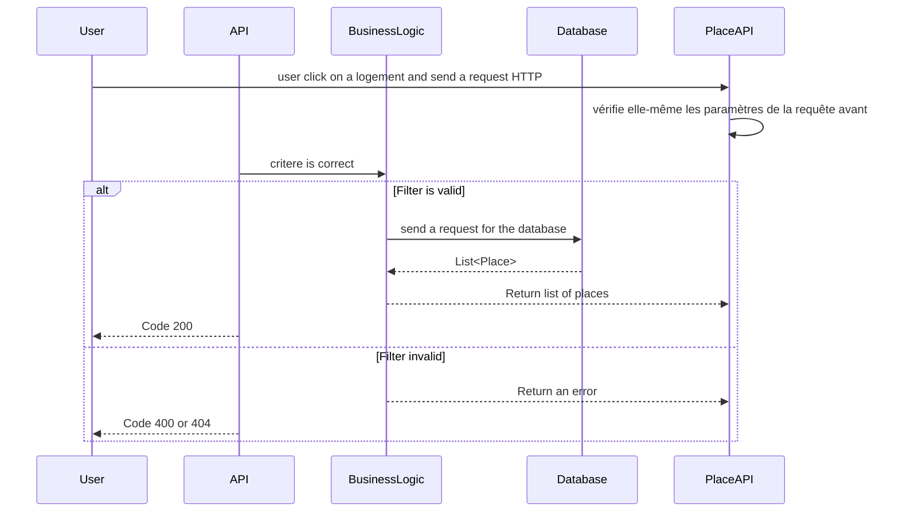
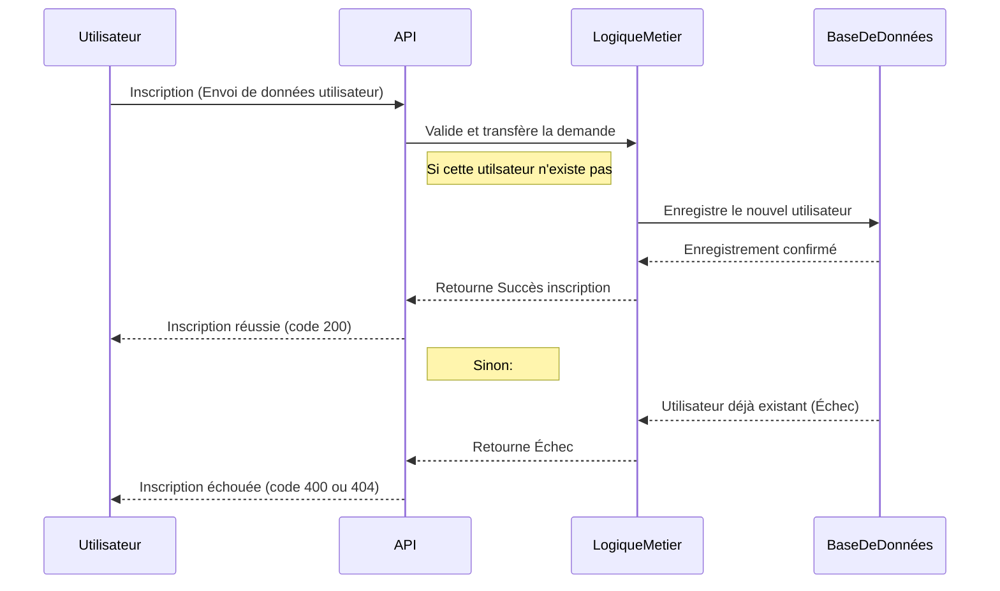

## Récupérer une liste de lieux - Version Boromir

```mermaid
sequenceDiagram
    participant User
    participant API
    participant BusinessLogic
    participant Database

    User->>PlaceAPI: user click on a logement and send a request HTTP
    PlaceAPI->>PlaceAPI: vérifie elle-même les paramètres de la requête avant
        API->>BusinessLogic: critere is correct
    alt Filter is valid
        BusinessLogic->>Database: send a request for the database
        Database-->>BusinessLogic: List<Place>
        BusinessLogic-->>PlaceAPI: Return list of places
        API-->>User: Code 200
    else Filter invalid
        BusinessLogic-->>PlaceAPI: Return an error
        API-->>User: Code 400 or 404
    end
```

## User Registration

```mermaid
sequenceDiagram
participant Utilisateur
participant API
participant LogiqueMetier
participant BaseDeDonnées
%% Inscription d’un nouvel utilisateur :
Utilisateur->>API: Inscription (Envoi de données utilisateur)
API->>LogiqueMetier: Valide et transfère la demande
Note right of API: Si cette utilsateur n'existe pas
LogiqueMetier->>BaseDeDonnées: Enregistre le nouvel utilisateur
BaseDeDonnées-->>LogiqueMetier: Enregistrement confirmé
LogiqueMetier-->>API: Retourne Succès inscription
API-->>Utilisateur: Inscription réussie (code 200)
Note right of API: Sinon:
BaseDeDonnées-->>LogiqueMetier: Utilisateur déjà existant (Échec)
LogiqueMetier-->>API: Retourne Échec
API-->>Utilisateur: Inscription échouée (code 400 ou 404)
```
