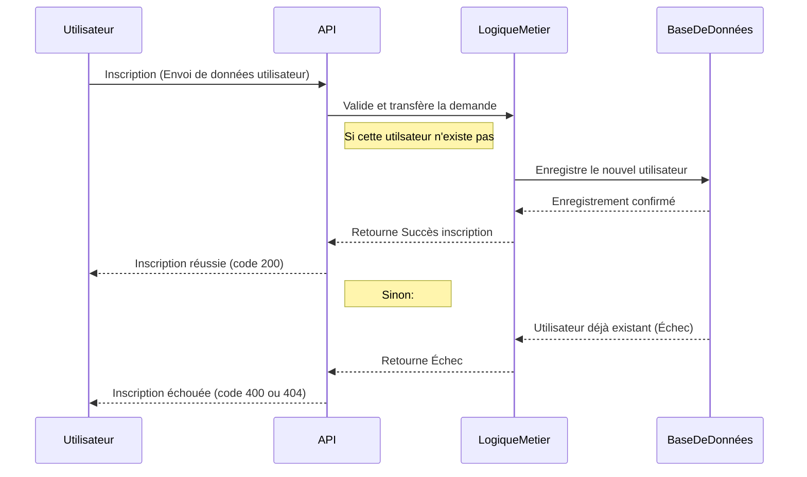
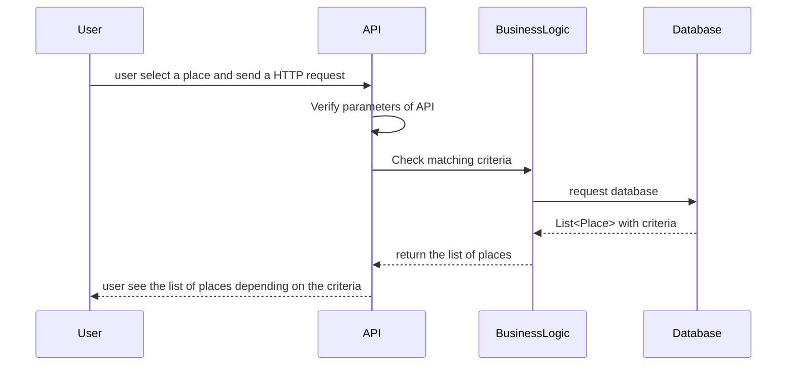

# User Registration

```mermaid
sequenceDiagram
participant Utilisateur
participant API
participant LogiqueMetier
participant BaseDeDonnées
%% Inscription d’un nouvel utilisateur :
Utilisateur->>API: Inscription (Envoi de données utilisateur)
API->>LogiqueMetier: Valide et transfère la demande
Note right of API: Si cette utilsateur n'existe pas
LogiqueMetier->>BaseDeDonnées: Enregistre le nouvel utilisateur
BaseDeDonnées-->>LogiqueMetier: Enregistrement confirmé
LogiqueMetier-->>API: Retourne Succès inscription
API-->>Utilisateur: Inscription réussie (code 200)
Note right of API: Sinon:
BaseDeDonnées-->>LogiqueMetier: Utilisateur déjà existant (Échec)
LogiqueMetier-->>API: Retourne Échec
API-->>Utilisateur: Inscription échouée (code 400 ou 404)
```

# Fetching a List of Places

```mermaid
sequenceDiagram
    participant User
    participant API
    participant BusinessLogic
    participant Database

    User->>API: user select a place and send a HTTP request
    API->>API: Verify parameters of API
    
    API->>BusinessLogic: Check matching criteria
    BusinessLogic->>Database: request database

    Database-->>BusinessLogic: List<Place> with criteria
	
    BusinessLogic-->>API: return the list of places

    API-->>User: user see the list of places depending on the criteria
```
