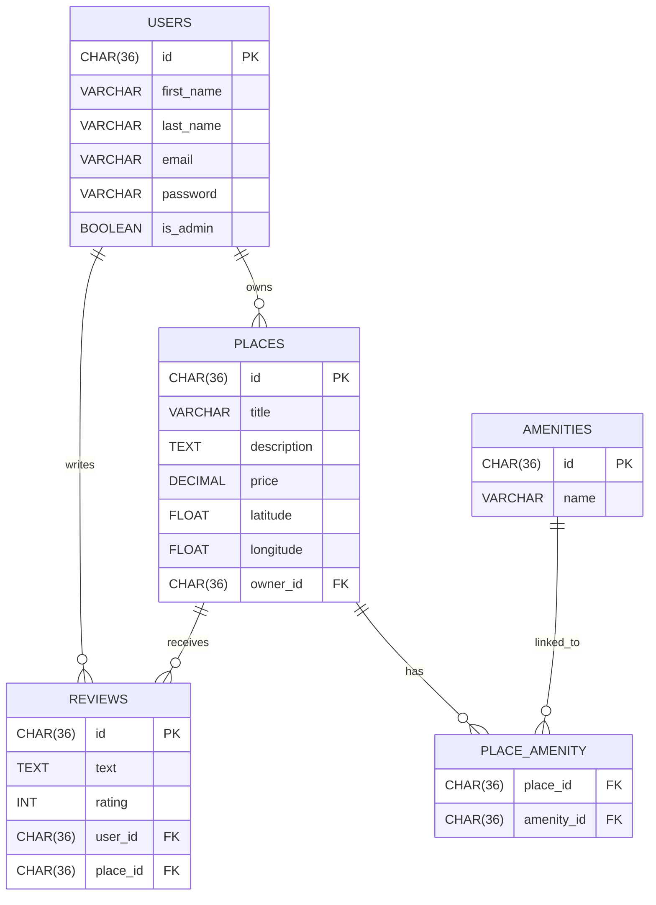
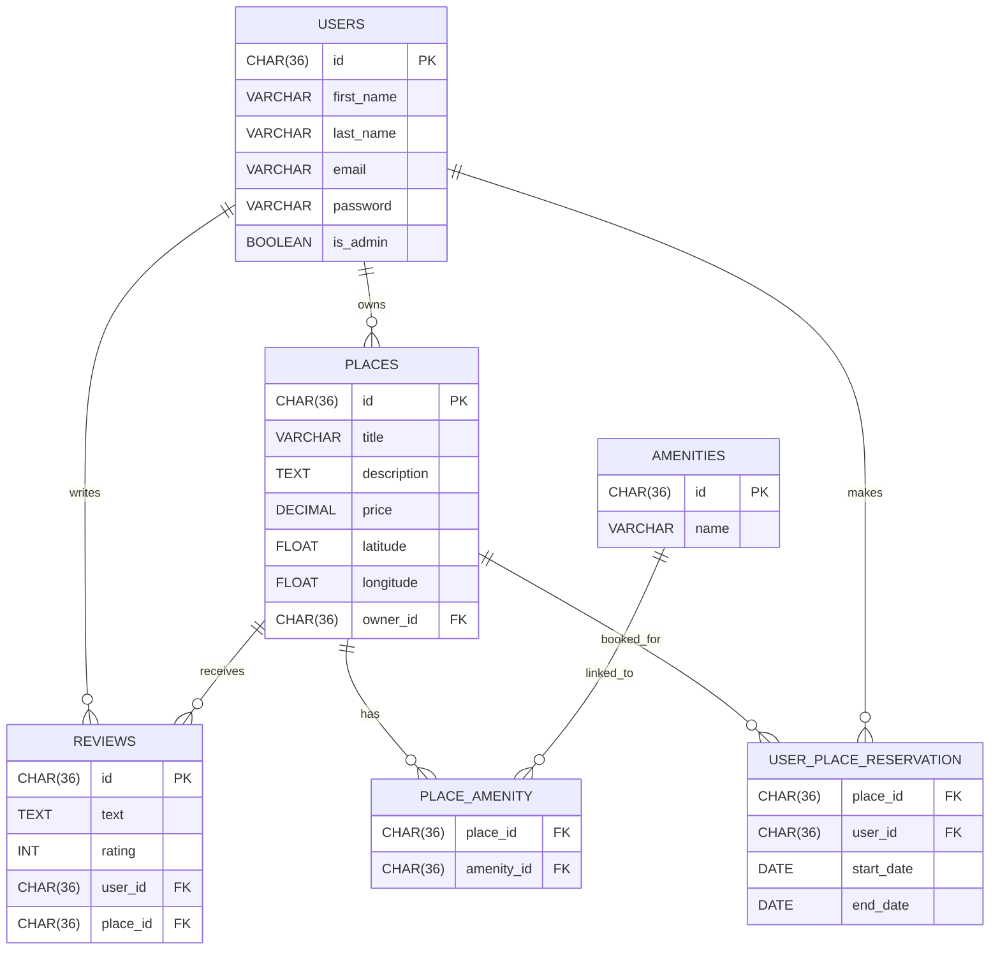

# Welcome to the HBNB - BL and API Project

## Presentation

HBnB is a RESTful API inspired by the AirBnB website, developed in Python with Flask and Flask-RESTX.  
The project follows a three-layer architecture developed in part 1 of the HBnB project.

### To run the application

1. Install dependencies using:
   `pip install -r requirements.txt`
2. Run the application:
   `python3 run.py` and for run the test : `python3 run_tests.py`
3. Leave the server:
   Press CTRL+C to exit the server. When you launched the server, it should have created an 'instance' folder with the database: 'development.db'
4. Add the SQL script to the database:
   `sqlite3 instance/development.db < app/database/schema.sql`

The application should now be running with the script SQL implemented.

---

## Purpose of each directory and file

# >>> from app import create_app, db
# >>> app = create_app()
# >>> app.app_context().push()  # <-- Active le contexte Flask
# >>> db.create_all()  # <-- Fonctionne maintenant !
pour la créaton d'une base de donnée

## Commande pour le lancement du script SQL

sqlite3 instance/development.db < app/database/schema.sql

### Diagramme de base de données

### Diagramme de base de donnée avec test d'intégration de la table USER_PLACE_RESERVATION

