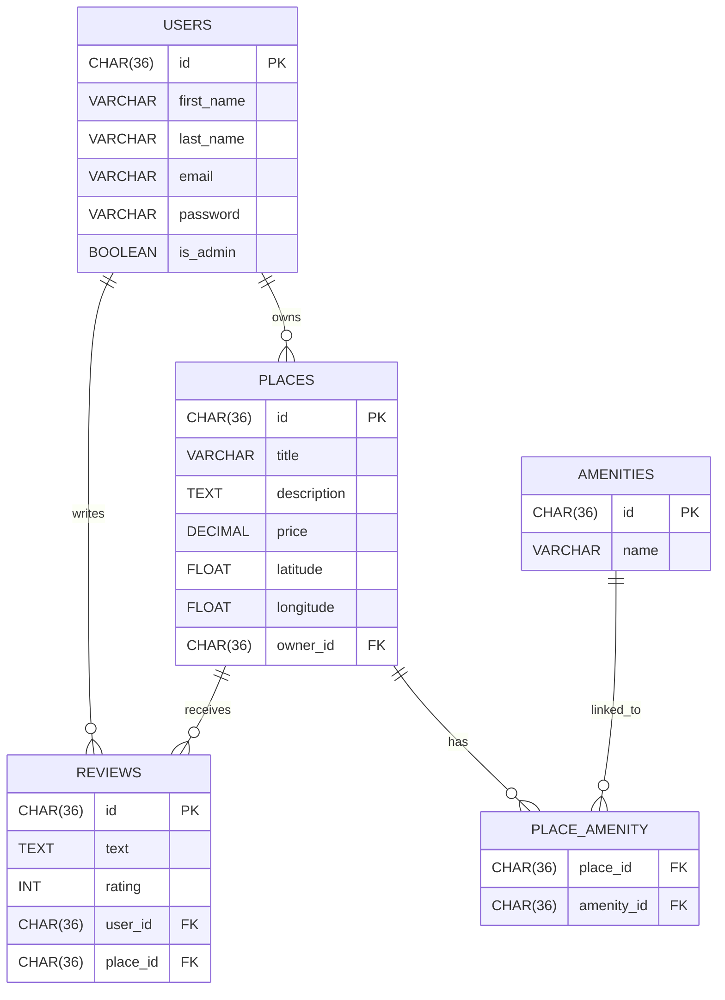
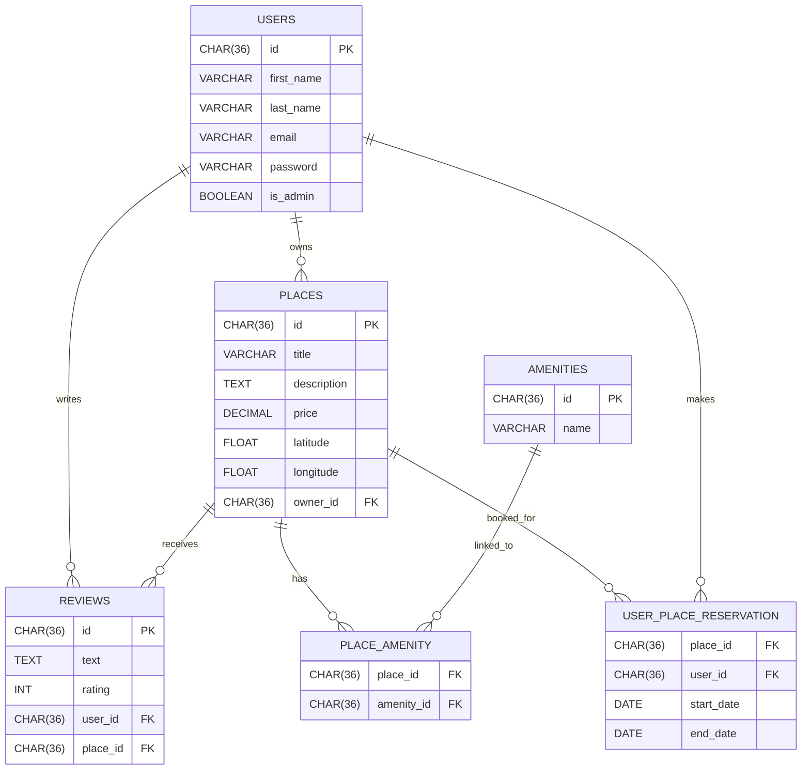

# Welcome to the HBNB - Enhanced Backend with Authentication and Database Integration

## Presentation

HBnB is a RESTful API inspired by the AirBnB website, developed in Python using Flask and Flask-RESTX.  
The project follows a three-layer architecture (presentation, business logic, persistence) introduced in Part 1 of the HBnB project.

## Project Objectives

🔐 Authentication & Authorization:
Implement JWT-based authentication using Flask-JWT-Extended and role-based access control through the is_admin attribute.

🗃️ Persistent Data Storage:
Replace in-memory storage with SQLite for development, and prepare MySQL integration for production environments using SQLAlchemy as the ORM.

⚙️ Database-Backed CRUD Operations:
Refactor all Create, Read, Update, and Delete operations to interact with a relational database.

🧭 Database Modeling and Visualization:
Design the relational schema and visualize entity relationships (User, Place, Review, Amenity) using Mermaid.js.

✅ Data Validation & Consistency:
Enforce data validation and integrity constraints within the SQLAlchemy models.

## Technology Stack

Flask – Web framework for API development
Flask-JWT-Extended – JWT-based authentication
SQLAlchemy – ORM for database modeling
SQLite – Development database
MySQL – Target production database
Mermaid.js – ER diagram visualization tool

## Key Deliverables

A secure and scalable backend API with authentication and authorization.
A fully connected relational database schema using SQLAlchemy models.
Visualized database architecture with Mermaid.js diagrams.
Clear separation of concerns across routes, models, and controllers.

## How to Run the Application

1. Install dependencies using:  
   ```bash
   pip install -r requirements.txt
   ```

2. Run the application:  
   ```bash
   python3 run.py
   ```

3. To run the tests:  
   ```bash
   python3 run_tests.py
   ```

4. Leave the server:  
   Press `CTRL+C` to exit the server. When you launch the server, it should create an `instance` folder with the database file `development.db`.

5. Add the SQL script to the database:  
   ```bash
   sqlite3 instance/development.db < app/database/schema.sql
   ```

6. The application should now be running with the SQL script implemented. You can now launch the application and open your web browser, then go to http://127.0.0.1:5000/api/v1

---

## Purpose of Each Directory and File


## API Endpoints

User authentication via JWT tokens.
Restricted access to sensitive routes based on user roles (admin vs. regular user).
Passwords securely hashed using bcrypt.

| Method | Endpoint           | Description                   | Auth required |
|--------|--------------------|-------------------------------|---------------|
| POST   | /auth/register     | Register a new user           | ❌            |
| POST   | /auth/login        | Get JWT token                 | ❌            |
| GET    | /users             | List all users (admin only)   | ✅            |
| GET    | /places            | List all places               | ❌            |
| POST   | /places            | Create new place              | ✅            |
| PUT    | /reviews/<id>      | Update review                 | ✅            |
| DELETE | /amenities/<id>    | Delete an amenity (admin)     | ✅            |


## Database Diagram



## Database Diagram with USER_PLACE_RESERVATION Integration



## Tests

All our tests were performed using Postman and Swagger, covering all CRUD operations.

## Author

👩‍💻 Thérèse-Marie Lefoulon & Robin David
🚀 Full-Stack Web Developer in training at Holberton School Laval — project-based and peer-learning curriculum
